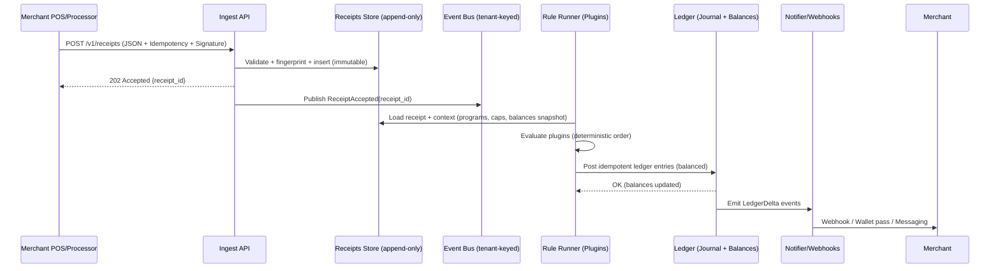

# Loyalty Ledger — Architecture & Scaffolding

A concise, implementation-ready blueprint for a **multi‑tenant, append‑only receipts log** with **modular reward plugins** and a **double‑entry loyalty ledger** (own‑brand + cross‑brand ready). This edition includes concrete guidance for deploying on **Render** (backend) and an optional hybrid with **Vercel** for the admin UI.

---

## Table of Contents
1. Goals & Non‑Goals  
2. End‑to‑End Flow (at a glance)  
3. Domain Model & Data Contracts  
4. API Surface (v1)  
5. Rules/Plugins Architecture  
6. Ledger Semantics (double‑entry)  
7. Multi‑Tenancy, Security & Consent  
8. Project Scaffolding (repo layout)  
9. Local Dev & Environments  
10. Testing Strategy & Invariants  
11. Observability & Operations  
12. Deployment & Platform Choice (Render)  
13. Roadmap (phased)  
14. Appendices (A–E)

---

## 1) Goals & Non‑Goals

**Goals**
- Ingest **signed, itemized receipts** in a standardized JSON shape (append‑only).
- Evaluate **deterministic reward rules** via modular plugins (points, stamps, coupons).
- Post **balanced ledger entries** for auditable liabilities and partner clearing.
- Enable **own‑brand** programs first; **cross‑brand** (consortium) as an optional layer.
- Make replays reproducible (receipts → recompute → same ledger).

**Non‑Goals (MVP)**
- No bank/issuer distribution rails.
- No SKU normalization at national scale (start with merchant category/sku).
- No instant inter‑merchant settlement (start with **monthly netting**).

---

## 2) End‑to‑End Flow (at a glance)



---

## 3) Domain Model & Data Contracts

### 3.1 Receipts (append‑only)
- **Immutability:** corrections are **adjustments** (new events) that reference prior receipts.
- **Idempotency:** `(tenant_id, idempotency_key)` unique; plus **deterministic fingerprint**.

**Receipt JSON (core)**
```json
{
  "schema_version": "1.0",
  "idempotency_key": "uuid",
  "issued_at": "2025-09-16T08:31:22Z",
  "currency": "ZAR",
  "merchant": { "merchant_id": "merch_abc", "store_id": "store_001", "name": "Blue Bottle 4th" },
  "buyer": { "account_ref": "acct_pseudo_wf7x", "consent_scopes": ["OWN_BRAND", "CROSS_BRAND_EARN"] },
  "payment": { "processor": "square", "processor_txn_id": "txn_48f", "method": "card" },
  "totals": { "subtotal": 102.61, "discounts": 10.00, "tax": 13.30, "grand_total": 105.91 },
  "line_items": [
    { "line_id": "1", "sku": "LATTE-12OZ", "category": "coffee", "qty": 1, "unit_price": 45.00, "attrs": {"milk":"oat"} },
    { "line_id": "2", "sku": "CROISSANT", "category": "bakery", "qty": 1, "unit_price": 35.00 }
  ],
  "signature": { "alg": "RS256", "kid": "merch-key-2025-01", "jws": "<JWS over canonical JSON>" },
  "meta": { "source": "pos_webhook" }
}
```

**Core Tables (Postgres; partition by month on `issued_at`)**
```sql
-- Receipts (immutable)
create table receipts (
  tenant_id text not null,
  receipt_id uuid primary key,
  idempotency_key text not null,
  issued_at timestamptz not null,
  currency text not null,
  grand_total_cents bigint not null,
  fingerprint bytea not null,
  source text,
  signature_status text,
  schema_version text not null,
  payload_json jsonb not null,
  replaces_receipt_id uuid,
  ingested_at timestamptz default now(),
  unique (tenant_id, idempotency_key),
  unique (tenant_id, fingerprint)
);

-- Optional line normalization (for analytics)
create table receipt_lines (
  tenant_id text not null,
  receipt_id uuid not null references receipts(receipt_id) on delete cascade,
  line_id text not null,
  sku text,
  category text,
  qty numeric(12,4) not null,
  unit_price_cents bigint not null,
  attrs_json jsonb,
  primary key (receipt_id, line_id)
);
```

**Fingerprint (example)**
```
hash(merchant_id|store_id|floor(issued_at/60s)|grand_total|processor_txn_id|account_ref)
```

### 3.2 Programs & Accounts (simplified)
```sql
create table programs (
  tenant_id text,
  program_id text,
  type text check (type in ('points','stamps','coupon','network_points')),
  currency text default 'points',
  config_json jsonb,
  primary key (tenant_id, program_id)
);

create table accounts (
  tenant_id text,
  account_id text,                 -- customer or liability/treasury
  kind text check (kind in ('customer','merchant_liability','treasury','partner_payable')),
  meta jsonb,
  primary key (tenant_id, account_id)
);
```

---

## 4) API Surface (v1)

### 4.1 Ingest Receipt
```
POST /v1/receipts
Headers: Idempotency-Key, X-Tenant-Id, X-Signature (JWS), Content-Type: application/json
Body: Receipt JSON (see §3.1)
200: { receipt_id, rules_applied: [...], summary: { points_earned, stamps_added, coupons_issued } }
409: idempotency conflict (returns existing receipt_id)
422: schema/signature errors
```

### 4.2 Balances
```
GET /v1/accounts/{account_id}/balances?program_id=...
200: [{ program_id, unit, qty }]
```

### 4.3 Redeem (burn)
```
POST /v1/redeem
Body: { account_id, program_id, unit: "points", qty, memo? }
200: { entry_id, new_balance }
```

### 4.4 Programs & Plugins
```
GET  /v1/programs
POST /v1/plugins/{plugin_id}/enable   (tenant-scoped)
POST /v1/plugins/{plugin_id}/config   (versioned; stores config hash)
```

> **OpenAPI**: publish `/openapi.json`; use Zod or JSON Schema to generate types.

---

## 5) Rules/Plugins Architecture

**Shape**
- **Registry** (`plugins`, `plugin_configs`) + **Runner** (pulls events; evaluates in deterministic order).
- **Contract**: `evaluate(receipt, context) -> Effect[]`
- **Deterministic**: no network calls; time = `receipt.issued_at`; seeded randomness by receipt fingerprint if ever used.
- **Queue semantics**: partition receipt events by `tenant_id`, keep only one in-flight per tenant, and surface backlog metrics so autoscaling never breaks ordering guarantees.

**Types (TypeScript)**
```ts
export type Unit = 'points'|'stamps'|'cents';
export type IntQty = bigint;            // integer minor units; matches ledger bigint columns
export type Effect =
  | { type: 'points_credit'; program_id: string; account_id: string; qty: IntQty; memo?: string; cap_key?: string }
  | { type: 'points_debit';  program_id: string; account_id: string; qty: IntQty; memo?: string }
  | { type: 'stamp_increment'; program_id: string; account_id: string; qty: IntQty }
  | { type: 'coupon_issue'; program_id: string; account_id: string; template_id: string; expiry_days?: number }
  | { type: 'partner_settlement'; from_account: string; to_account: string; qty: IntQty; unit: 'cents'; memo?: string };

export interface Context {
  tenantId: string;
  accountId: string;                 // resolved from receipt.buyer.account_ref
  programs: Record<string, any>;
  getBalance: (programId: string, unit: Unit) => Promise<IntQty>;
  getCapped: (key: string, period: 'DAY'|'WEEK'|'MONTH', limit: number) => Promise<{allowed: number}>;
}

export interface Plugin {
  id: string;
  version: string;
  evaluate(receipt: any, ctx: Context): Promise<Effect[]>;
}
```
> All `IntQty` values are whole-number minor units (no floats) so replayed effects exactly match ledger entries.

**Built‑ins (start set)**
- `percent_points` (e.g., `2% of grand_total`)
- `category_bonus` (e.g., +50 points if any `category=coffee`)
- `nth_free_stamps` (issue coupon on every N stamps)
- `fixed_bonus_first_purchase` (per account)
- `network_earn_rate` (for consortium pilots)

**Idempotent posting**
```
entry_id = uuid_v5( namespace="ledger",
                    name=hash(plugin_id|plugin_version|config_hash|receipt_fingerprint) )
```

---

## 6) Ledger Semantics (double‑entry)

**Journal + Lines**
```sql
create table ledger_journal (
  entry_id uuid primary key,
  tenant_id text not null,
  ts timestamptz not null default now(),
  program_id text not null,
  receipt_id uuid,
  plugin_id text not null,
  plugin_version text not null,
  config_hash bytea,
  memo text
);

create table ledger_lines (
  entry_id uuid references ledger_journal(entry_id) on delete cascade,
  line_no smallint not null,
  account_id text not null,
  dr bigint default 0,
  cr bigint default 0,
  unit text not null check (unit in ('points','stamps','cents')),
  primary key (entry_id, line_no),
  check ((dr = 0 and cr > 0) or (cr = 0 and dr > 0))
);

-- Materialized summary for fast reads
create materialized view balances as
select j.tenant_id, l.account_id, j.program_id, l.unit, sum(l.cr) - sum(l.dr) as qty
from ledger_journal j join ledger_lines l using (entry_id)
group by j.tenant_id, l.account_id, j.program_id, l.unit;
```
Plan how the view stays fresh: run `refresh materialized view concurrently balances` on a tight cadence (or migrate to an incrementally maintained balances table) and alert if the refresh age drifts beyond your SLA.

**Posting patterns**
- **Earn (own‑brand points):**  
  `Dr Merchant_Liability_points / Cr Customer_points`
- **Redeem (at same merchant):**  
  `Dr Customer_points / Cr Merchant_Liability_points`
- **Redeem (at partner):**  
  `Dr Customer_points / Cr Partner_Payable` → net monthly → `Dr Partner_Payable / Cr Cash`
- **Adjustment (void/return):** reverse with a compensating entry.

**Invariants**
- Each entry: `Σ(debits) == Σ(credits)`
- Balances never negative unless explicitly allowed (e.g., exposure for partner).

---

## 7) Multi‑Tenancy, Security & Consent

**Tenant Isolation**
- Postgres **Row‑Level Security (RLS)** on all tenant tables.
```sql
alter table receipts enable row level security;
create policy by_tenant on receipts
  using (tenant_id = current_setting('app.tenant_id', true));
```
- Long-lived workers (rule runner, notifier) must `set_config('app.tenant_id', tenantId, true)` before touching tenant data and mirror matching policies across receipts, ledger, caps, etc., so cross-tenant leakage is impossible.

**Auth & Signatures**
- API keys scoped to `tenant_id` and per‑store if needed.  
- **JWS** merchant signatures (verify via JWKS). Start with HMAC header if needed for MVP.  
- TLS everywhere; rotating keys; deterministic canonicalization before JWS.

**Identity & Consent**
- `buyer.account_ref` = pseudonymous merchant‑scoped token (hash of card token or phone with tenant salt).  
- Cross‑brand link only if **consent_scopes** include `CROSS_BRAND_*`.  
- Store any PII in a separate vault; reference by opaque IDs.

**Privacy & Retention**
- Raw receipts: 13–24 months; ledger: forever.  
- Subject access/erasure: keep mappings detachable from ledger (ledger uses pseudonyms).

**(Optional) Confidential Mode**
- Run Rule Runner + Ledger inside a TEE (e.g., SGX) with remote attestation that rules/settlement ran as declared. Nice-to-have for cross‑brand trust.

---

## 8) Project Scaffolding (repo layout)

```text
loyalty-ledger/
├─ apps/
│  ├─ api/                      # Fastify/NestJS or Go Fiber; REST + OpenAPI
│  ├─ rule-runner/              # Queue consumer; plugin host; idempotent posting
│  ├─ notifier/                 # Webhooks, wallet pass, messaging adapters
│  ├─ admin-console/            # (Later) React/Next.js console for programs/rules
│  └─ settlement/               # Monthly netting & payout exports
├─ packages/
│  ├─ schema-receipt/           # JSON Schema + zod types for receipt
│  ├─ ledger-core/              # Posting, invariants, entry builders
│  ├─ plugin-sdk/               # Types + helpers (Context, caps, balances)
│  ├─ plugins-builtins/         # percent_points, category_bonus, etc.
│  ├─ adapters/                 # square, clover, csv, shopify mappers
│  └─ shared/                   # logging, config, tracing, errors
├─ db/
│  ├─ migrations/               # SQL (Sqitch/Prisma/Goose) + seeds
│  └─ views/                    # materialized views, refresh scripts
├─ infra/
│  ├─ docker-compose.yaml       # Postgres, Redis, Kafka/SQS local
│  ├─ render/                   # Render blueprint & service docs
│  └─ k8s/                      # (Later) Helm charts for self-managed clusters
├─ tests/
│  ├─ unit/
│  ├─ integration/              # uses docker-compose services
│  └─ property/                 # ledger invariants, replay idempotency
├─ scripts/                     # make targets, local dev scripts
└─ .github/workflows/           # CI: lint, test, db-migrate, docker build
```

**Tech picks (opinionated but swappable)**
- **Language:** TypeScript (Node 20+) for API/Runner; Go also works.
- **Web:** Fastify + Zod (runtime validation) + OpenAPI.
- **DB:** Postgres 15+; Prisma/Drizzle or raw SQL for ledger.
- **Queue:** Kafka (ideal) or SQS; Redis Streams for MVP.
- **Auth:** Signatures (JWS/HMAC), API keys, JWKS rotation.
- **Infra:** Containerized; Render for managed deploys; K8s later if needed.

---

## 9) Local Dev & Environments

**docker-compose (local)**
- `postgres`, `kafka` (or `localstack` SQS), `redis`.
- Seed scripts: create tenants, programs, accounts.

**Environment config**
```
APP_ENV=local|staging|prod
DATABASE_URL=postgres://...
QUEUE_BROKER=kafka://... | sqs://... | redis://...
JWT_JWKS_URL=https://merchant.example/.well-known/jwks.json
RLS_TENANT_VAR=app.tenant_id
```

**Make targets**
```
make db.up        # start db
make migrate      # run SQL migrations
make seed         # seed tenants/programs
make api.dev      # start API with hot reload
make runner.dev   # start rule runner
make e2e          # run full loop tests
```

---

## 10) Testing Strategy & Invariants

**Unit**
- Receipt validator, fingerprint, signature verification.
- Plugin effects with fixed receipts (golden tests).

**Integration**
- Full loop: POST receipt → plugin effects → ledger balances → webhook.
- Idempotency: same `idempotency_key` and same fingerprint → no double‑post.
- Adjustments: void/return creates balancing entries.

**Property‑based**
- **Ledger invariants:** For any sequence of effects, entries always balance.
- **Replay determinism:** Receipts replay → identical ledger entry IDs (given same plugin version & config hash).

**Performance**
- Partition pruning on `receipts`; materialized `balances` refresh cost.

---

## 11) Observability & Operations

**Logging**
- Correlate by `receipt_id` and `entry_id`. Mask PII.

**Metrics**
- `receipts_ingested_count`, `rules_applied_count`, `ledger_post_latency_ms`, `webhook_delivery_success_rate`, `duplicate_receipt_rate`.

**Tracing**
- Span: API ingest → Runner eval → Ledger post → Notifier.

**Admin**
- Invariants job (cron):  
  - `sum(debits)=sum(credits)` per entry  
  - No negative merchant liability (unless flagged)  
  - Duplicate fingerprints rate  
- Dead‑letter queue with replayer UI.

---

## 12) Deployment & Platform Choice (Render)

**Why Render fits this architecture**
- **Background Workers** for the always‑on **Rule Runner** and **Notifier** (queue consumers).
- **Web Services** for the **API** (Fastify/NestJS/Go).
- **Cron Jobs** for **monthly netting**, **breakage reports**, and invariants checks.
- **Managed Postgres** co‑located with services for low‑latency ledger writes.
- **Managed Redis (or Key‑Value)** for caps, rate limits, and lightweight queues (or use Kafka/SQS if you prefer).
- **Static outbound IPs** available if an upstream needs allowlisting.
- Clean **secrets & env management**, health checks, autoscaling, and per‑service logs.

**Recommended deployment map**
```
Render
├─ Service: api            (type: Web Service; Node 20)
├─ Service: rule-runner    (type: Background Worker; Node/Go)
├─ Service: notifier       (type: Background Worker)
├─ Service: settlement     (type: Cron Job; monthly + daily tasks)
├─ Database: postgres      (managed Postgres; production tier)
└─ Cache: redis            (managed Redis; optional if you use Kafka/SQS)
```

**Hybrid option (optional)**
- **Vercel** just for `apps/admin-console` (Next.js previews/CDN).
- Everything else on **Render**. Point console to the Render API URL.

**Environment variables (examples)**
```
DATABASE_URL=postgres://<render-managed-db>
REDIS_URL=redis://:<password>@<render-redis-host>:6379
QUEUE_BROKER=redis://... | kafka://... | sqs://...
JWT_JWKS_URL=https://merchant.example/.well-known/jwks.json
STATIC_EGRESS=true             # flip on if upstream allowlisting is required
```

**Minimal render.yaml (Blueprint) — adjust paths/commands as needed**
```yaml
services:
  - type: web
    name: ledger-api
    env: node
    plan: standard
    branch: main
    rootDir: .
    installCommand: pnpm install --frozen-lockfile
    buildCommand: pnpm --filter api... build
    startCommand: pnpm --filter api... start
    autoDeploy: true
    healthCheckPath: /healthz
    envVars:
      - key: DATABASE_URL
        fromDatabase:
          name: ledger-postgres
          property: connectionString
      - key: REDIS_URL
        value: ${REDIS_URL}

  - type: worker
    name: ledger-rule-runner
    env: node
    plan: standard
    branch: main
    rootDir: .
    installCommand: pnpm install --frozen-lockfile
    buildCommand: pnpm --filter rule-runner... build
    startCommand: pnpm --filter rule-runner... start
    autoDeploy: true
    envVars:
      - key: DATABASE_URL
        fromDatabase:
          name: ledger-postgres
          property: connectionString
      - key: REDIS_URL
        value: ${REDIS_URL}

  - type: worker
    name: ledger-notifier
    env: node
    plan: standard
    branch: main
    rootDir: .
    installCommand: pnpm install --frozen-lockfile
    buildCommand: pnpm --filter notifier... build
    startCommand: pnpm --filter notifier... start
    autoDeploy: true
    envVars:
      - key: DATABASE_URL
        fromDatabase:
          name: ledger-postgres
          property: connectionString

  - type: cron
    name: ledger-settlement
    env: node
    schedule: "0 2 * * *" # 02:00 UTC daily; add monthly job in-app
    branch: main
    rootDir: .
    installCommand: pnpm install --frozen-lockfile
    buildCommand: pnpm --filter settlement... build
    startCommand: pnpm --filter settlement... start
    envVars:
      - key: DATABASE_URL
        fromDatabase:
          name: ledger-postgres
          property: connectionString

databases:
  - name: ledger-postgres
    databaseName: ledger_prod
    plan: standard
```

> Notes:  
> • Run dependency installs once per workspace (Render `installCommand: pnpm install --frozen-lockfile`) and let each service call `pnpm --filter <app> build` to reuse the cache.  
> • Ensure each app exposes matching `build`/`start` scripts so the filtered commands resolve in every environment.  
> • If you prefer Kafka/SQS over Redis, provision externally and set `QUEUE_BROKER`.  
> • Turn on **static egress IPs** on services that call allowlisted upstreams.  
> • Apply autoscaling cautiously for the Rule Runner to preserve per‑tenant ordering (key by `tenant_id`) and surface queue lag metrics so scale-up happens before ordering breaks.  
> • Use a **dead‑letter queue** for poison receipts; add a “replay” command to reprocess from the receipts log.

**CI/CD**
- On push to `main`, run tests + DB migrations, then Render auto‑deploys services.  
- Keep migrations **backwards‑compatible**; roll by: migrate → deploy → backfill → cutover.

---

## 13) Roadmap (phased)

**Phase 0 — Prove the loop (2–3 weeks)**
- Receipt schema + validator; HMAC auth.
- `/v1/receipts`, `/balances`.
- Built‑ins: `percent_points`, `category_bonus`, `nth_free_stamps`.
- Ledger posting + invariants + notifier (webhook).
- CSV & one POS adapter.
- Deploy API + Rule Runner + Postgres on **Render**.

**Phase 1 — Productionize (3–5 weeks)**
- Merchant JWS signatures + JWKS.
- Caps/limits; fraud (replay/anomaly).
- Coupons/redemptions + barcode/QR.
- Admin Console v1 (program builder) — deploy to Vercel or Render.
- Refreshable `balances` and basic analytics.

**Phase 2 — Cross‑brand pilot (4–8 weeks)**
- Consortium config (earn/burn, fees).
- Monthly netting, exposure caps, payout export.
- Breakage reporting; dispute adjustments.
- Optional: TEE‑attested Rule Runner.

---

## 14) Appendices (A–E)

- **Appendix A — Example Program Config (YAML)**
- **Appendix B — Example Plugin (TypeScript)**
- **Appendix C — Ledger Posting (pseudo)**
- **Appendix D — RLS Bootstrap (SQL)**
- **Appendix E — Receipt JSON Schema (excerpt)**

> The appendices mirror the originals and are unchanged; include them in your repo under `/docs/`.
